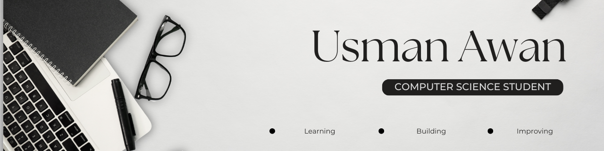

  

🎓 Doing BSc(Hons) in Computer Science

💻 Exploring software development, machine learning, and problem solving.

🌱 Currently learning:
- C++
- Python
- Data Structures & Algorithms
- Git & GitHub
- Machine Learning Fundamentals

🚀 Goals
- Build consistent projects
- Improve problem-solving skills
- Learn web development

🎯 Interested In:
- Cyber Security
- Artificial Intelligence 
- Software Development

## Tech Stack

## GitHub Stats

## Contribution Streak

